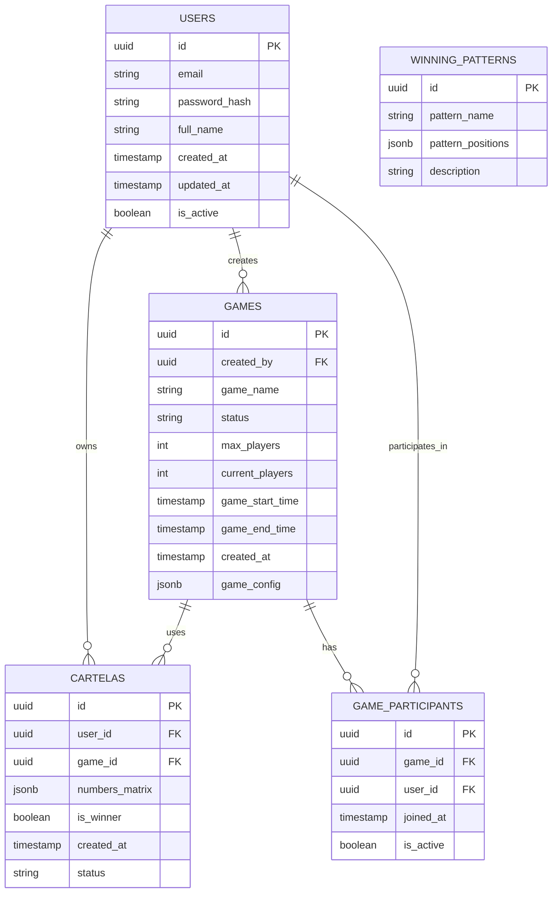
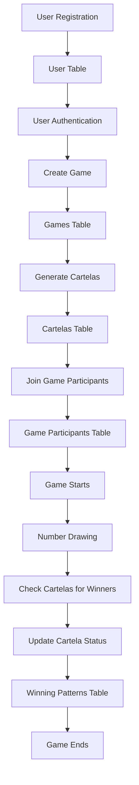

# Database Flowchart - Bingo Application

## Overview
This flowchart represents the database structure and relationships for the bingo application using Supabase.

## Database Schema



## Entity Relationships Explained

### Users ↔ Games (One-to-Many)
- A user can create multiple games
- Each game has one creator

### Users ↔ Cartelas (One-to-Many)
- A user can have multiple bingo cards
- Each card belongs to one user

### Games ↔ Cartelas (One-to-Many)
- A game can have multiple bingo cards
- Each card is associated with one game

### Users ↔ Game Participants (Many-to-Many)
- Users can participate in multiple games
- Games can have multiple participants
- Tracked through GAME_PARTICIPANTS junction table

### Games ↔ Game Participants (One-to-Many)
- A game can have multiple participants
- Each participant record links to one game

## Data Flow



## Key Tables Description

### Users Table
- **Purpose**: Stores user account information
- **Key Fields**:
  - `id`: Primary key (UUID)
  - `email`: Unique user email
  - `full_name`: User's display name
  - `is_active`: Account status

### Games Table
- **Purpose**: Manages bingo game instances
- **Key Fields**:
  - `id`: Primary key (UUID)
  - `created_by`: Reference to Users table
  - `game_name`: Display name for the game
  - `status`: active, completed, cancelled
  - `max_players`: Maximum allowed participants
  - `game_config`: JSON configuration for game rules

### Cartelas Table
- **Purpose**: Stores bingo cards with number matrices
- **Key Fields**:
  - `id`: Primary key (UUID)
  - `user_id`: Owner of the card
  - `game_id`: Associated game
  - `numbers_matrix`: 5x5 grid of numbers (JSON)
  - `is_winner`: Whether this card has won
  - `status`: active, completed, void

### Game Participants Table
- **Purpose**: Tracks which users are playing which games
- **Key Fields**:
  - `game_id`: Reference to Games table
  - `user_id`: Reference to Users table
  - `joined_at`: When user joined the game
  - `is_active`: Current participation status

### Winning Patterns Table
- **Purpose**: Defines different winning patterns (lines, diagonals, full house, etc.)
- **Key Fields**:
  - `pattern_name`: Name of the pattern (e.g., "Horizontal Line")
  - `pattern_positions`: Array of positions that form the pattern
  - `description`: Human-readable description

## Common Operations

### User Registration & Authentication
```sql
-- Insert new user
INSERT INTO users (email, password_hash, full_name)
VALUES ('user@example.com', 'hashed_password', 'John Doe');

-- Authenticate user
SELECT * FROM users WHERE email = 'user@example.com' AND is_active = true;
```

### Game Creation
```sql
-- Create new game
INSERT INTO games (created_by, game_name, max_players, game_config)
VALUES ('user_uuid', 'Friday Night Bingo', 50, '{"pattern": "full_house"}');
```

### Card Generation
```sql
-- Generate bingo card for user in game
INSERT INTO cartelas (user_id, game_id, numbers_matrix)
VALUES ('user_uuid', 'game_uuid', '[[1,16,31,46,61], [2,17,32,47,62], ...]');
```

### Winner Detection
```sql
-- Check for winning pattern
SELECT c.*, wp.pattern_name
FROM cartelas c
JOIN winning_patterns wp ON check_winning_pattern(c.numbers_matrix, wp.pattern_positions)
WHERE c.game_id = 'current_game_uuid' AND c.is_winner = false;
```

## Security Considerations

- All UUID fields use PostgreSQL's UUID type for secure, unique identifiers
- Passwords are stored as hashes, never in plain text
- Row Level Security (RLS) policies should be implemented to ensure users can only access their own data
- Game creators have administrative access to their games
- Participants can only view cards associated with their user ID

## Performance Optimizations

- Indexes on foreign key columns for efficient joins
- JSONB columns for flexible game configuration and card matrices
- Partitioning strategy for large game history tables
- Efficient winner detection algorithms using array operations
